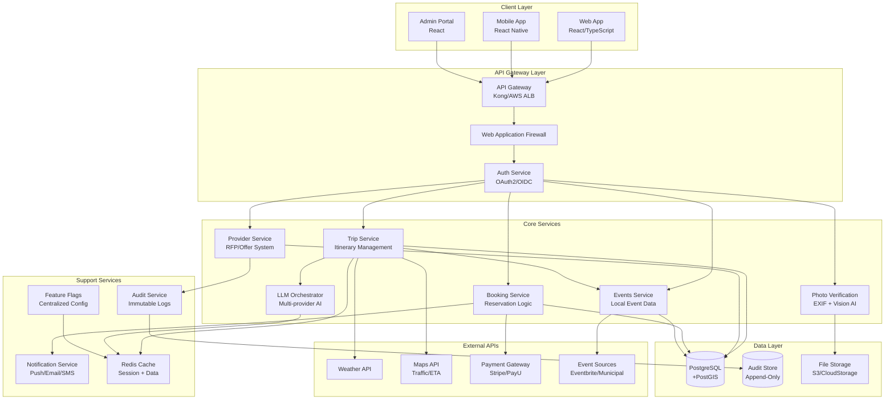

# GoaGuide Architecture Overview

## High-Level Architecture

## Microservice Catalogue

### 1. API Gateway Service
**Responsibilities:**
- Request routing and load balancing
- Authentication and authorization
- Rate limiting and throttling
- Request/response transformation
- API versioning

**Technology Stack:**
- Kong Gateway or AWS Application Load Balancer
- WAF integration (AWS WAF/Cloudflare)
- SSL termination and certificate management

**Key APIs:**
- `/api/v1/*` - Core application APIs
- `/provider/api/v1/*` - Provider-facing APIs
- `/admin/api/v1/*` - Admin console APIs

**Feature Flags:**
- `api_gateway_enabled`
- `rate_limiting_enabled`
- `waf_protection_enabled`

---

### 2. Trip Service
**Responsibilities:**
- Trip creation and management
- Itinerary generation and optimization
- Budget constraint enforcement
- Follow-up question handling

**Database Tables:**
- `trips` - Trip metadata and state
- `itineraries` - Generated itinerary data
- `trip_answers` - User responses to follow-ups

**Key APIs:**
- `POST /api/v1/trips` - Create new trip
- `POST /api/v1/trips/{id}/answers` - Submit answers
- `GET /api/v1/trips/{id}/itinerary` - Get itinerary
- `PUT /api/v1/trips/{id}` - Update trip details

**Events Published:**
- `trip.created`
- `itinerary.generated`
- `budget.exceeded`

**Feature Flags:**
- `trip_creation_enabled`
- `itinerary_optimization_enabled`
- `budget_enforcement_enabled`

---

### 3. Provider Service
**Responsibilities:**
- Vendor onboarding and KYC
- RFP distribution (anonymized)
- Offer collection and validation
- Provider portal management

**Database Tables:**
- `providers` - Vendor information
- `rfps` - Request for proposals
- `offers` - Provider responses
- `provider_documents` - KYC documentation

**Key APIs:**
- `POST /provider/api/v1/register` - Vendor registration
- `POST /provider/api/v1/rfps` - Receive RFP
- `POST /provider/api/v1/rfps/{id}/offers` - Submit offer
- `GET /provider/api/v1/dashboard` - Provider dashboard

**Events Published:**
- `provider.registered`
- `rfp.sent`
- `offer.received`

**Feature Flags:**
- `provider_rfp_enabled`
- `auto_rfp_distribution`
- `provider_onboarding_enabled`

---

### 4. Booking Service
**Responsibilities:**
- Booking orchestration (hold → confirm → cancel)
- Payment processing integration
- Refund management
- Idempotency enforcement

**Database Tables:**
- `bookings` - Booking records
- `payments` - Payment transactions
- `refunds` - Refund records
- `booking_holds` - Temporary reservations

**Key APIs:**
- `POST /api/v1/trips/{id}/bookings` - Create booking
- `PUT /api/v1/bookings/{id}/confirm` - Confirm booking
- `DELETE /api/v1/bookings/{id}` - Cancel booking
- `POST /api/v1/bookings/{id}/refund` - Process refund

**Events Published:**
- `booking.created`
- `booking.confirmed`
- `booking.cancelled`
- `payment.processed`

**Feature Flags:**
- `auto_booking_enabled`
- `payment_processing_enabled`
- `refund_processing_enabled`

---

### 5. Events Service
**Responsibilities:**
- Local event data ingestion
- Event deduplication and confidence scoring
- Curator queue management
- Real-time event impact assessment

**Database Tables:**
- `events` - Event master data
- `event_sources` - Data source configuration
- `event_duplicates` - Deduplication tracking
- `curator_queue` - Manual review queue

**Key APIs:**
- `GET /events` - Search events by location/date
- `POST /admin/api/v1/events` - Manual event creation
- `PUT /admin/api/v1/events/{id}` - Curator approval
- `POST /api/v1/events/ingest` - Bulk event import

**Events Published:**
- `event.ingested`
- `event.deduplicated`
- `event.approved`

**Feature Flags:**
- `events_ingest_enabled`
- `auto_deduplication_enabled`
- `curator_queue_enabled`

---

### 6. LLM Orchestrator Service
**Responsibilities:**
- Multi-provider LLM routing
- Prompt caching and optimization
- Cost control and budgeting
- Hallucination detection

**Supported Providers:**
- Rocket AI (primary scaffolder)
- ChatGPT Pro (prompt engineering)
- Claude (long context analysis)
- Local LLMs (Llama/Mistral for extraction)

**Key APIs:**
- `POST /llm/api/v1/generate` - Generate content
- `POST /llm/api/v1/extract` - Structured extraction
- `GET /llm/api/v1/cache/{hash}` - Cached responses
- `POST /llm/api/v1/moderate` - Content moderation

**Feature Flags:**
- `llm_orchestration_enabled`
- `prompt_caching_enabled`
- `hallucination_detection_enabled`

---

### 7. Photo Verification Service
**Responsibilities:**
- EXIF data validation
- GPS coordinate verification
- Device sensor attestation
- Vision model spoof detection

**Key APIs:**
- `POST /api/v1/trips/{id}/photo` - Upload and verify photo
- `GET /api/v1/photos/{id}/status` - Verification status
- `POST /admin/api/v1/photos/{id}/review` - Manual review

**Feature Flags:**
- `photo_verification_enabled`
- `exif_validation_enabled`
- `vision_model_enabled`

---

### 8. Audit Service
**Responsibilities:**
- Immutable audit logging
- Compliance reporting
- Trace ID correlation
- Data retention management

**Database Tables:**
- `audit_logs` - Immutable audit records
- `trace_correlation` - Request tracing
- `compliance_reports` - Generated reports

**Key APIs:**
- `POST /audit/api/v1/log` - Write audit entry
- `GET /admin/api/v1/audit/search` - Search audit logs
- `POST /admin/api/v1/audit/report` - Generate compliance report

**Feature Flags:**
- `audit_logging_enabled`
- `compliance_reporting_enabled`

## Security Architecture

### Authentication & Authorization
- **OAuth2/OIDC** with Auth0 or AWS Cognito
- **MFA required** for admin users
- **JWT tokens** with 15-minute TTL
- **Refresh token rotation** every 24 hours

### Network Security
- **mTLS** for internal service communication
- **API Gateway** with rate limiting
- **WAF** protection against OWASP Top 10
- **VPC isolation** for database access

### Data Protection
- **Encryption at rest** (AES-256)
- **Encryption in transit** (TLS 1.3)
- **Tokenized payments** (no card storage)
- **PII anonymization** in provider RFPs

### Compliance
- **GDPR/PDP compliance** with right-to-erase
- **Audit trails** for all data access
- **Data retention policies** (90 days hot, 3+ years cold)
- **Consent management** with immutable tokens

## Deployment Architecture

### Container Strategy
- **Docker containers** for all services
- **Kubernetes** orchestration (EKS/GKE/AKS)
- **Helm charts** for deployment management
- **CI/CD pipelines** with GitHub Actions

### Environment Separation
- **Development** - Local Docker Compose
- **Staging** - Kubernetes cluster (shared)
- **Production** - Kubernetes cluster (dedicated)
- **DR Site** - Cross-region backup

### Monitoring & Observability
- **Prometheus** for metrics collection
- **Grafana** for visualization
- **Jaeger** for distributed tracing
- **ELK Stack** for log aggregation
- **PagerDuty** for alerting

## Scalability Considerations

### Horizontal Scaling
- **Stateless services** for easy scaling
- **Load balancers** for traffic distribution
- **Auto-scaling groups** based on metrics
- **Database read replicas** for query scaling

### Caching Strategy
- **Redis** for session and application cache
- **CDN** for static asset delivery
- **API response caching** with TTL
- **Database query result caching**

### Performance Optimization
- **Connection pooling** for database access
- **Async processing** for heavy operations
- **Batch processing** for bulk operations
- **Lazy loading** for large datasets
